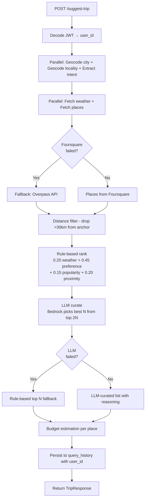
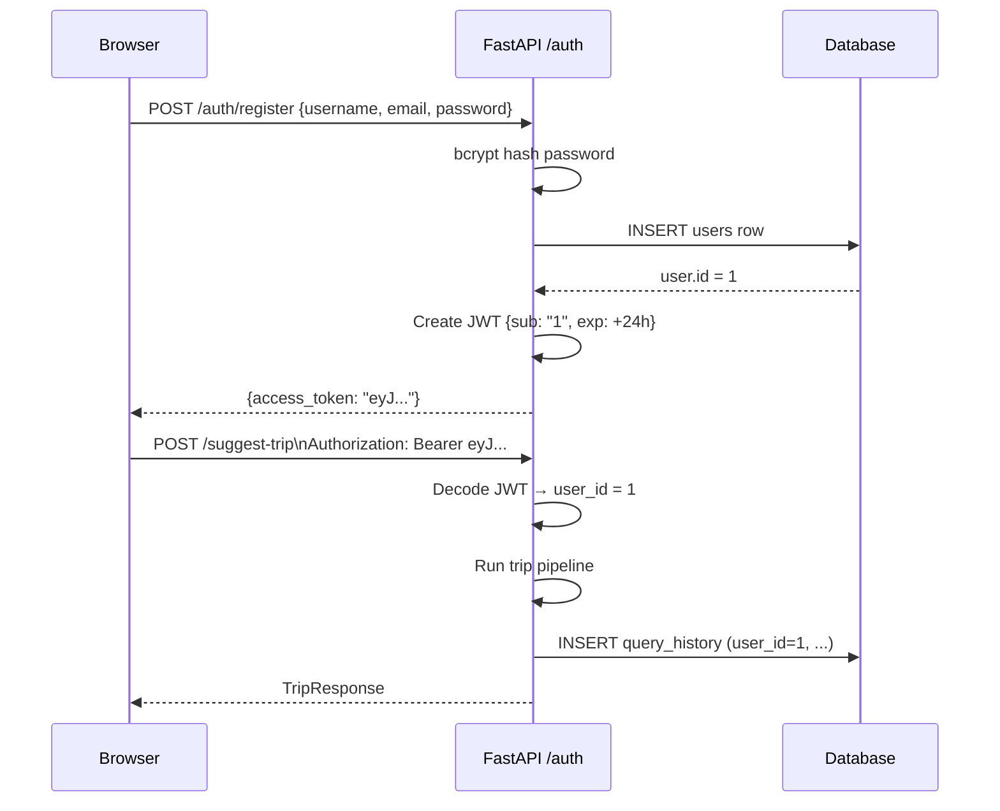

# Architecture — Local Travel Suggester

**Date:** 2026-05-25
**Version:** 2.0 (post-rebuild)

---

## 1. System Overview

Local Travel Suggester is a full-stack web application that provides AI-curated place recommendations for a given city, personalised by the user's expressed preference and real-time weather data.

```
┌─────────────────────────────────────────────────────┐
│                    Browser                           │
│   React + Tailwind (Vite)                            │
│   ┌──────────┐  ┌─────────────┐  ┌──────────────┐   │
│   │LoginPage │  │DashboardPage│  │HistoryPage   │   │
│   └──────────┘  └─────────────┘  └──────────────┘   │
└────────────────────────┬────────────────────────────┘
                         │ HTTP REST (JSON) + JWT
┌────────────────────────▼────────────────────────────┐
│               FastAPI Backend (uvicorn)              │
│                                                      │
│  /auth/*        /suggest-trip    /history  /health   │
│      │                │              │         │     │
│  AuthService    TripService     DB Query    Probes   │
│      │                │                             │
│  DB: users      ┌─────┴──────────────────────┐      │
│                 │     Trip Pipeline           │      │
│                 │  Geocode  Weather  Places   │      │
│                 │  Rank     LLM      Budget   │      │
│                 └────────────────────────────┘      │
└──────────────┬──────────────────────────────────────┘
               │
    ┌──────────┼────────────────────────────┐
    │          │                            │
┌───▼──┐  ┌───▼──────┐  ┌──────────┐  ┌───▼───────┐
│SQLite│  │OpenWeather│  │Foursquare│  │AWS Bedrock│
│  /   │  │    API    │  │Places API│  │Nova Lite  │
│Postgres  └──────────┘  └─────┬────┘  └───────────┘
└──────┘                       │
                        ┌──────▼──────┐
                        │OSM Overpass │
                        │(fallback)   │
                        └─────────────┘
```

---

## 2. Backend Layer Design

The backend uses a strict 4-layer pattern: **API → Service → Client → DB**. No layer skips another.

```
routes_auth.py ──► auth_service.py ──► db/models.py (User)
routes_trip.py ──► trip_service.py ──► clients/* ──► external APIs
                                   └──► db/models.py (QueryHistory)
routes_health.py ──► direct probes (no service layer needed)
```

### Why this layering?
- **API layer** only parses HTTP, calls services, returns HTTP responses. No business logic.
- **Service layer** has no HTTP knowledge. Can be unit-tested without FastAPI.
- **Client layer** has no business logic. Each client owns one external system.
- **DB layer** has no business logic. Session management is handled by `get_db()` dependency.

This separation means you can replace FastAPI with Flask or test services without spinning up a server.

---

## 3. Trip Suggestion Pipeline



---

## 4. Authentication Flow



---

## 5. Intent Extraction Flow

```mermaid
flowchart TD
    P["User preference text"] --> R["Rule-based parser\nkeyword bucket matching"]
    R --> Q{"Strong\nmatch?"}
    Q -- Yes --> T["TripIntent: category=food, etc."]
    Q -- No\n\"tourist\" default --> L["LLM: Bedrock extract_intent\nStructured JSON output"]
    L --> V["Validate + normalise\nagainst VALID_CATEGORIES"]
    V --> T
    T --> FS["Foursquare query=search_keywords"]
```

**Why rule-based first?** 90% of common prompts ("food", "history", "nature") match known keyword buckets. We avoid paying LLM latency (1–2 seconds) for the obvious cases and only escalate to Bedrock for genuinely ambiguous inputs like "I'm feeling tired" or "fun weekend with the family."

---

## 6. Place Ranking Algorithm

```
score = 0.20 × weather_fit
      + 0.45 × preference_match    ← dominant signal
      + 0.15 × popularity
      + 0.20 × proximity
```

**weather_fit:** 1.0 if place type matches weather (rainy → indoor; sunny → outdoor), 0.15 for mismatch.

**preference_match:** 1.0 if place categories/name/description hit the user's intent bucket. 0.1 if user specified a bucket but place has none of those signals (hard push-down).

**popularity:** Normalised from Foursquare rating (0–10 → 0–1) or popularity score.

**proximity:** Linear from 1.0 (at user's locality) to 0.0 (25 km away). Neutral 0.6 when no locality provided.

**Diversity cap:** At most 2 places per primary category in the final N. Prevents "5 museums in a row" for history prompts.

---

## 7. LLM Usage

Three distinct LLM calls, each with a clear purpose and a deterministic fallback:

| Call | When | Input → Output | Fallback |
|------|------|---------------|----------|
| `extract_intent` | On every request (if rule-based fails) | Preference text → `{category, keywords, mood}` | Rule-based default category |
| `curate_places` | After rule-based ranking | Top 2N shortlist → best N with reasons | Rule-based top N |
| `generate_place_reasoning` | Only if curate didn't supply reasons | Place + weather → 1–2 sentence reason | Deterministic template string |

**Safety rule:** The LLM never invents places. `curate_places` validates every name it returns against the input list. Any hallucinated name is silently dropped. If all picks are hallucinated, the rule-based ranking is used.

---

## 8. Frontend Component Design

```
App.jsx (router + auth guard)
├── LoginPage.jsx
│   ├── RegisterTab  (username, email, password)
│   └── LoginTab     (email, password)
│
├── DashboardPage.jsx
│   ├── TripForm     (city, preference, locality, max_results)
│   ├── WeatherCard  (condition, temp, humidity)
│   ├── SuggestionList
│   │   └── SuggestionCard × N (name, reasoning, distance, budget, categories)
│   └── MapView      (react-leaflet, numbered pins, locality marker)
│
└── HistoryPage.jsx
    └── HistoryList  (city, preference, date, suggestion count)
```

**State management:**
- `AuthContext` holds `{ token, user }`. Persisted to `localStorage`.
- `DashboardPage` holds local `useState` for `{ loading, results, error }`.
- No global state store (no Redux/Zustand needed for 3 pages).

---

## 9. Database Strategy

SQLAlchemy 2.0 with two supported backends:

| Environment | DATABASE_URL | Notes |
|-------------|-------------|-------|
| Development | `sqlite:///./test.db` | Zero setup, fast for tests |
| Production | `postgresql+psycopg://...` | Neon PostgreSQL via env var |

The `JSON` column type maps to `JSONB` on PostgreSQL and `TEXT`-backed JSON on SQLite. The application code never branches on database type.

**Why not Alembic?** For this project scale, `Base.metadata.create_all()` on startup is sufficient. Adding Alembic would require managing migration files across schema changes, which adds overhead not justified by the single-developer, demo-scope nature of this project. This is a known tradeoff, not an oversight.

---

## 10. Observability

| Signal | Implementation |
|--------|---------------|
| Structured logs | JSON via Python `logging`; every log includes `request_id` |
| Request tracing | `RequestIdMiddleware` generates 12-char UUID per request |
| Health checks | `/health` (liveness) + `/health/detailed` (readiness per dependency) |
| Response metadata | `meta.elapsed_ms`, `meta.cache_hits`, `meta.degraded` in every TripResponse |
| DB audit | `query_history` table captures every request with latency |

---

## 11. Key Architectural Decisions vs. Alternatives

| Decision | Alternative Considered | Why Rejected |
|----------|----------------------|-------------|
| Single `LLMClient` class | Abstract `LLMProvider` + subclasses (original) | 3 classes for 1 provider adds no value; harder to read |
| `useContext` for auth state | Redux, Zustand | 3 pages need 1 shared value; Context is the right tool |
| SQLite for tests | Dockerised PostgreSQL | Eliminates Docker dependency from test setup; SQLAlchemy handles differences |
| Rule-based ranking + LLM curate | LLM-only ranking | LLM is non-deterministic and slow; rule-based is cheap and explainable |
| JWT auth | Cookie sessions | Stateless; works with a separate frontend dev server (different port) |
| Vite + React JS | Create React App / Next.js | Vite is faster; no SSR needed; JS avoids TypeScript overhead for 3 pages |
